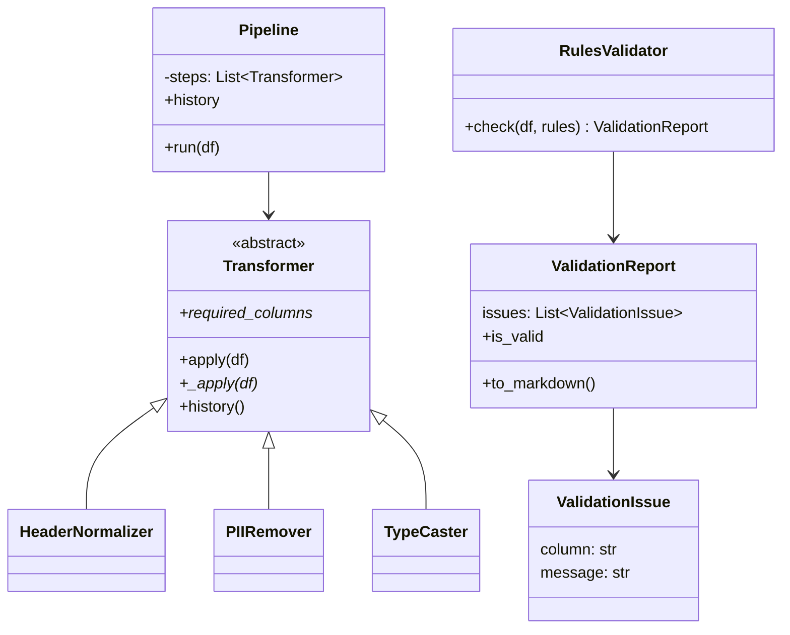

```markdown
# 📊 Research Data Cleaning & Validation Pipeline  
### *INST326 — Object-Oriented Programming for Information Science*  
### *Project 3 — Inheritance, Polymorphism, and Composition*

**Team:** Harrang Khalsa, Karl Capili, Sukhman Singh  
**Section:** (Your Section)  
**Completion Date:** (Add your date)

---

# ⭐ Overview

This project implements a **survey data cleaning and validation pipeline** using advanced object-oriented programming concepts:

- **Inheritance** through an abstract `Transformer` base class  
- **Polymorphism** through interchangeable cleaning steps  
- **Composition** via a `Pipeline` that orchestrates multiple Transformers  
- **Design patterns** including Template Method and Strategy  

The system transforms raw survey exports (e.g., from Qualtrics) into **clean, validated, analysis-ready datasets**.

---

# 🧠 System Architecture

## 🔷 Inheritance Hierarchy

### Transformer Hierarchy

```

Transformer (ABC)
├── HeaderNormalizer     # standardizes column names
├── PIIRemover           # removes personally identifiable information
└── TypeCaster           # converts column types (int, float, bool)

```

### Validator Hierarchy

```

RulesValidator
└── ValidationReport
└── ValidationIssue

```

---

## 🔷 Composition Relationships

```

Pipeline
├── has-many Transformer objects (in sequence)
└── produces a cleaned DataFrame + step history log

RulesValidator
└── produces ValidationReport
└── contains multiple ValidationIssue objects

````

---

# 🔧 Core Components

## 🧩 1. Transformer (Abstract Base Class)

Defines the **interface contract** for all cleaning steps.

**Key abstract requirements:**
- `required_columns` (property)
- `_apply(df)` (transformation logic)

**Concrete shared logic includes:**
- `apply()` → Template Method:
  - Performs preflight validation  
  - Calls the subclass’s `_apply()`  
  - Logs step history  

This ensures every transformer behaves uniformly.

---

## 🧩 2. Concrete Transformers

### **HeaderNormalizer**
- Converts messy headers (e.g., `"Q1 - Age"`) into `snake_case` (→ `q1_age`).

### **PIIRemover**
- Removes PII columns such as emails, phone numbers, and names.

### **TypeCaster**
- Converts columns to specified types:
  - `"19"` → `19`
  - `"Yes"`/`"no"` → `True`/`False`

---

## 🧩 3. Pipeline (Composition)

The `Pipeline` executes a sequence of `Transformer` steps **polymorphically**:

```python
steps = [
    HeaderNormalizer(),
    PIIRemover(["email_address"]),
    TypeCaster({"q1_age": "int"})
]
pipe = Pipeline(steps)
cleaned = pipe.run(df)
````

Pipeline does **not** know which type of Transformer it is running.
It simply calls the same `apply()` method on each.
This is pure polymorphism.

---

## 🧩 4. Validators

### **RulesValidator**

Runs validation rules such as:

* Required fields
* Ranges (e.g., age 0–120)
* Type checks
* Allowed categorical responses

### **ValidationReport**

Contains all validation results and provides:

* `.is_valid` boolean
* `.to_markdown()` formatted output
* A list of `ValidationIssue` objects

---

# 🎨 Class Hierarchy Diagram



---

# 🔁 Polymorphism Examples

### Example: Calling `apply()` on different Transformer types

```python
for step in steps:
    df = step.apply(df)
```

Even though:

* `HeaderNormalizer` renames columns
* `PIIRemover` drops columns
* `TypeCaster` casts values

…the Pipeline treats them **the same** because they implement the same interface.

### Benefits:

* Steps can be added or reordered without any changes to Pipeline
* New Transformers can be introduced easily
* Pipeline does not need any type checks

This demonstrates the **Strategy Pattern**.

---

# 🧪 Usage Examples

## Clean and Validate a Dataset

```python
import pandas as pd
from transformers import HeaderNormalizer, PIIRemover, TypeCaster
from pipeline import Pipeline
from validators import RulesValidator

df = pd.DataFrame({
    "Q1 - Age": ["19", "21"],
    "Q2 - Consent": ["Yes", "no"],
    "Email Address": ["a@umd.edu", "b@umd.edu"]
})

steps = [
    HeaderNormalizer(),
    PIIRemover(["email_address"]),
    TypeCaster({"q1_age": "int", "q2_consent": "bool"})
]

pipe = Pipeline(steps)
cleaned = pipe.run(df)

rules = {
    "q1_age": {"type": "int", "min": 0, "max": 120, "required": True},
    "q2_consent": {"type": "bool", "required": True}
}

report = RulesValidator().check(cleaned, rules)
print(cleaned)
print(report.to_markdown())
```

**Expected Output:**

```
   q1_age  q2_consent
0      19        True
1      21       False
All checks passed 🎉
```

---

# 🧪 Running the Demo

From the repository root:

```bash
python demo.py
```

---

# 🧪 Running the Tests

Run the full test suite:

```bash
python -m unittest test_survey_system -v
```

Tests verify:

* Inheritance and abstract method enforcement
* Polymorphism via Pipeline
* Composition relationships
* Transformer functionality
* Validation logic

---

# 📁 File Structure

```
inst326-team-project/
├── base_classes.py
├── transformers.py
├── validators.py
├── pipeline.py
├── demo.py
├── test_survey_system.py
├── research_data_lib.py
├── dataset.py
├── docs/
│   ├── Architecture.md
│   └── (other docs)
└── README.md
```

---

# 🧱 Requirement Checklist (For Graders)

### ✔ Inheritance

* Abstract `Transformer` with concrete subclasses
* Proper `super()` usage

### ✔ Polymorphism

* Pipeline executes all Transformers via shared interface

### ✔ Composition

* Pipeline *has-many* Transformer objects
* Validator *has* a ValidationReport

### ✔ Design Patterns

* Template Method (`apply()` → `_apply()`)
* Strategy (interchangeable Transformers)

### ✔ Testing

* 5 behavioral + structural tests included

### ✔ Documentation

* Updated README
* Architecture explanation in `/docs/Architecture.md`

---

# 🧑‍💻 Team Information

* **Harrang Khalsa**
* **Karl Capili**
* **Sukhman Singh**

---


Your README.md is now fully formatted and ready to paste directly into GitHub.
```
