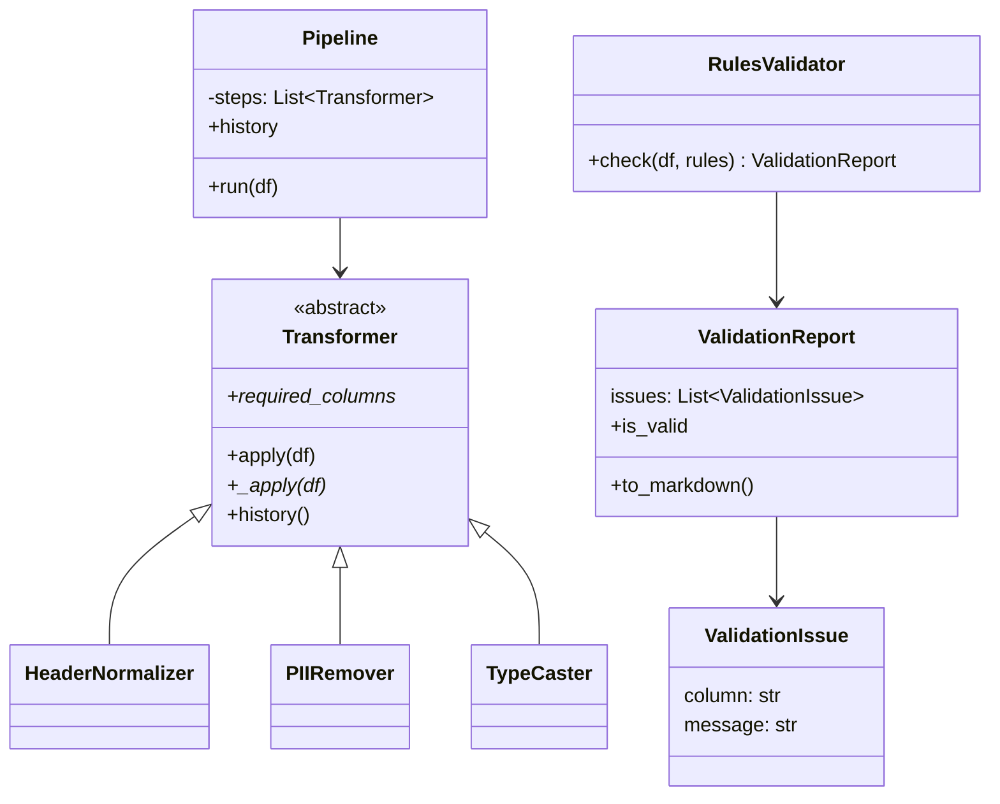

# Research Data Cleaning & Validation Pipeline  
### INST326 — Object-Oriented Programming for Information Science  
### Project 3 — Inheritance, Polymorphism, and Composition

**Team:** Harrang Khalsa, Karl Capili, Sukhman Singh  
**Section:** 0301
**Completion Date:** November 23, 2025

---

# Overview

This project implements a survey data cleaning and validation pipeline using advanced object-oriented programming concepts:

- Inheritance via an abstract `Transformer` base class  
- Polymorphism through interchangeable data-cleaning steps  
- Composition in a `Pipeline` that executes multiple Transformers in sequence  
- Design patterns including the Template Method and Strategy patterns  

The system transforms raw survey exports (e.g., from Qualtrics or Google Forms) into clean, validated, analysis-ready datasets.

---
## 🧭 Domain: Survey Data Cleaning & Validation

Our project focuses on the **Survey Data Cleaning & Validation** domain, specializing in transforming raw survey exports (e.g., Qualtrics, Google Forms) into clean, standardized, and validated datasets suitable for research analysis.

Survey datasets often contain:
- Messy or inconsistent column names (e.g., “Q1 - Age”)
- Mixed data types (“19” as a string, “Yes/No” as text)
- Personally identifiable information (PII)
- Missing or invalid responses
- Columns with inconsistent formatting across survey waves

Our pipeline addresses these issues through:
- **Header standardization** (to consistent `snake_case`)
- **Removal of sensitive PII fields**
- **Type casting** (e.g., string → int/bool)
- **Structured validation rules** to enforce:
  - Required fields  
  - Type correctness  
  - Range checks  
  - Logical constraints  

This domain mirrors real-world research workflows in academic labs, UX teams, and social science datasets.
---

# System Architecture

## Inheritance Hierarchy

### Transformer Hierarchy
```

Transformer (ABC)
├── HeaderNormalizer
├── PIIRemover
└── TypeCaster

```

### Validator Hierarchy
```

RulesValidator
└── ValidationReport
└── ValidationIssue

```

## Composition Relationships

```

Pipeline
├── has-many Transformer objects
└── produces a cleaned DataFrame + step history log

RulesValidator
└── produces a ValidationReport
└── which contains multiple ValidationIssue objects

````

---

# Core Components

## 1. Transformer (Abstract Base Class)

Defines the shared interface and behavior for all cleaning steps.

**Abstract requirements:**
- `_apply(df)` – subclass-specific transformation logic  
- `required_columns` – columns required for the step to run  

**Concrete shared logic:**
- `apply()` – template method that:
  - Performs preflight validation  
  - Calls the subclass `_apply`  
  - Logs step history  

This ensures uniform behavior across all cleaning classes.

---

## 2. Concrete Transformers

### HeaderNormalizer
Normalizes messy column headers (e.g., `"Q1 - Age"` → `q1_age`).

### PIIRemover
Removes personally identifiable information (email, phone, names).

### TypeCaster
Converts survey values to the appropriate data types:
- `"19"` → `19`
- `"Yes"` → `True`

---

## 3. Pipeline (Composition)

The `Pipeline` composes multiple Transformers and executes them in sequence.

Example:
```python
steps = [
    HeaderNormalizer(),
    PIIRemover(["email_address"]),
    TypeCaster({"q1_age": "int"})
]
pipe = Pipeline(steps)
cleaned = pipe.run(df)
````

The Pipeline does not need to know the type of each step.
It simply calls `apply()` on all of them.
This is polymorphism.

---

## 4. Validators

### RulesValidator

Runs rule-based validation such as:

* Required fields
* Value ranges
* Data-type enforcement
* Allowed categories

### ValidationReport

Stores all issues and provides:

* `is_valid` boolean
* `to_markdown()` formatted output
* A list of `ValidationIssue` objects

---

# Class Diagram



---

# Polymorphism Examples

### Example: Pipeline calling `apply()` without knowing the subclass type

```python
for step in steps:
    df = step.apply(df)
```

Behavior differs per subclass, but the interface stays the same.

Benefits:

* Steps are interchangeable
* New Transformers can be added freely
* No type-checking or conditional logic
* Pipeline stays simple

This follows the **Strategy Pattern**.

---

# Usage Example

```python
import pandas as pd
from transformers import HeaderNormalizer, PIIRemover, TypeCaster
from pipeline import Pipeline
from validators import RulesValidator

df = pd.DataFrame({
    "Q1 - Age": ["19", "21"],
    "Q2 - Consent": ["Yes", "no"],
    "Email Address": ["a@umd.edu", "b@umd.edu"]
})

steps = [
    HeaderNormalizer(),
    PIIRemover(["email_address"]),
    TypeCaster({"q1_age": "int", "q2_consent": "bool"})
]

pipe = Pipeline(steps)
cleaned = pipe.run(df)

rules = {
    "q1_age": {"type": "int", "min": 0, "max": 120, "required": True},
    "q2_consent": {"type": "bool", "required": True}
}

report = RulesValidator().check(cleaned, rules)

print(cleaned)
print(report.to_markdown())
```

**Expected Output:**

```
   q1_age  q2_consent
0      19        True
1      21       False
All checks passed 🎉
```

---

# Running the Demo

```
python demo.py
```

---

# Running Tests

```
python -m unittest test_survey_system -v
```

Tests verify:

* Inheritance
* Abstract method enforcement
* Polymorphism in Pipeline
* Behavior of each Transformer
* Validation logic and reporting

---
## 🧩 Design Decisions

Our design is centered around clear separation of concerns, extensibility, and the use of object-oriented design principles.

### 1. Use of an Abstract Base Class (ABC)
We created a `Transformer` abstract class to define the required interface for all cleaning steps:
- Every transformer must implement `_apply(self, df)`
- Every transformer declares `required_columns`
- Shared behavior (`apply`, `_preflight`, `_log`, `history`) lives in the ABC

**Why?**  
This enforces consistency and allows the Pipeline to treat all cleaning steps uniformly, enabling polymorphism.

---

### 2. Polymorphism via the Pipeline
The `Pipeline` executes a list of Transformers without caring about their concrete types.  
This is classic **Strategy pattern** behavior.

---

## ⚙️ Installation & Setup

### 1. Clone the repository
```bash
git clone https://github.com/karlcap8/inst326-team-project
cd inst326-team-project
```
### 2. Install dependencies
Dependencies are listed in requirements.txt.

Install them with:

```bash
pip install -r requirements.txt
```
### 3. Verify installation
Run the unit tests:

```bash
python -m unittest test_survey_system -v
```
Run the demo script:

```bash
python demo.py
```
If both commands run without errors, the project is correctly installed.

### Requirements
- Python 3.10+
- pandas
- numpy

All dependencies are included in the repository’s requirements.txt.

---

# File Structure

```
inst326-team-project/
├── base_classes.py
├── transformers.py
├── validators.py
├── pipeline.py
├── demo.py
├── test_survey_system.py
├── research_data_lib.py
├── dataset.py
├── docs/
│   ├── Architecture.md
│   └── (other docs)
└── README.md
```

---

# Requirement Checklist

### Inheritance

* Abstract base class
* Concrete subclasses
* Proper `super()` usage

### Polymorphism

* Pipeline executes all Transformers via shared interface

### Composition

* Pipeline has multiple Transformer objects
* RulesValidator produces a ValidationReport

### Design Patterns

* Template Method
* Strategy Pattern

### Testing

* All tests included in `test_survey_system.py`

### Documentation

* Updated README
* Architecture document in `/docs/Architecture.md`

---

# Team Information

* Harrang Khalsa
* Karl Capili (performed Pipeline, Validator, and integration work due to team member departure)
* Sukhman Singh

